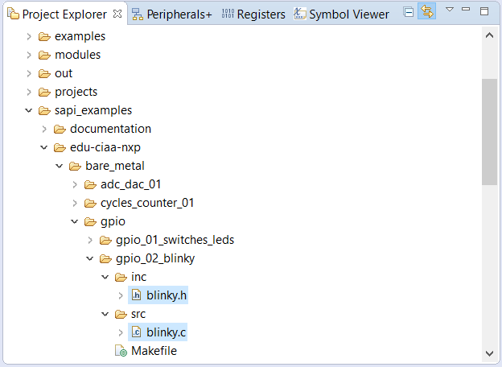
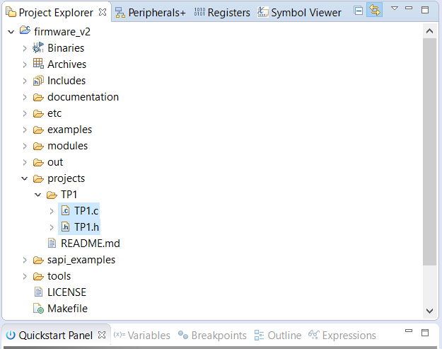
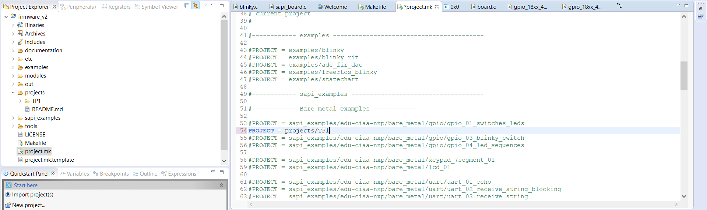
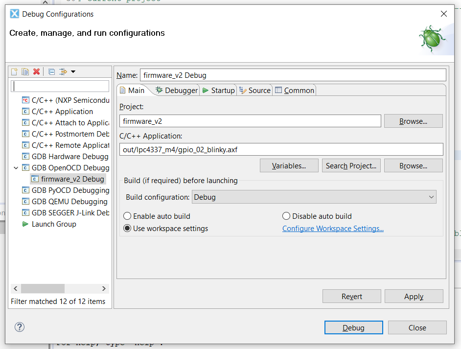

# Sistemas Embebidos
Repositorio para el seminario de sistemas embebidos 86.65

- Ruiz Santiago
- Ciafardini Juan
- Molina Segundo
- Turtula Emanuel

# Documentación del TP1
**Objetivo**
- **Uso del IDE** edición, compilación y depuración de programas.
- **Uso de GPIO** manejo de Salidas y Entradas Digitales.
- **Documentar lo que se solicita en c/ítems** 

# 1 IDE
Se descargó MCUXpresso v11.0.0 para Windows y se instalaron los complementos de OpenOCD, eGit y Yakindu StateChart Tools según la [hoja de ayuda](https://campus.fi.uba.ar/pluginfile.php/307047/mod_resource/content/5/Sistemas_Embebidos-2019_2doC-Instalacion_de_Herramientas-Cruz.pdf) de la materia.

## 1.1 Firmware
Utilizando git se descargó el repositorio *firmware_v2* y se copió el archivo *project.mk.template* a *project.mk* utilizando los siguientes comandos:
```sh
$ git clone https://github.com/ciaa/firmware_v2.git
$ cd firmware_v2
$ git status -s
$ git checkout master
$ cp project.mk.template project.mk
```
Luego se abrió el IDE, creando un workspace con el nombre Workspace_TPs_SE_2019 y se agregó el firmware_v2. Luego en File--New--Other--C/C++--Makefile Project with Existing Code...

- En **Existing Code Location Browse** se colocó la ubicación de la carpeta *firmware_v2*.
- Se destildó el casillero **C++**.
- Se seleccionó la opción **Cross GCC ó ARM Cross GCC**.

El archivo project.mk se configuró de la siguiente forma:

- PROJECT = sapi_examples/edu-ciaa-nxp/bare_metal/gpio/gpio_02_blinky
- TARGET = lpc4337_m4
- BOARD = edu_ciaa_nxp

## 1.2 Debug
Se hizo click derecho sobre la carpeta *firmware_v2* y en el menú se seleccionó la opción **Build**. Luego, para realizar el **Debug** se hizo click derecho sobre la carpeta *firmware_v2* y en el menú se seleccionó *Debug As--Debug Configurations...*.

## 1.3 Migrar blinky a TP1
Se copiaron los archivos del ejemplo blinky a la carpeta *projects/TP1* y se le cambió el nombre de los archivos .c y .h a *TP1*.       
        
        

        


Previamente a la compilación del proyecto se cambió la ruta dentros del   *project.mk*  por: *PROJECT = projects/TP1*. También se recomienda hacer un *clean* antes de compilar. 

        

Para hacer un debug primero se cambió, en la ventana de *debug configurations*, la opción *GBD OpenOCD Debugging*

        

# 1.3.a Acceso a los GPIO


Haciendo *Step Into* en las funciones *boardConfig()* y *gpioWrite()* se abren los archivos *sapi_board.c* y *sapi_gpio.c*.


En el cuerpo de la función *boardConfig()* se llama a una serie de funciones de inicalización, en particular para GPIO, se llama a la función *gpioConfig()*, la misma llama a las funciones de bajo nivel *Chip_GPIO_Init* *Chip_SCU_PinMux* y *Chip_GPIO_SetDir*, las mismas permiten respectivamente, habilitar el pin del puerto, seleccionar la función del mismo y el tipo de GPIO (entrada, salida, con o sin PULLUPS o PULLDOWNS en varias combinaciones).


En el cuerpo de la función *gpioWrite(gpioMap\_t,bool\_t)*, que se transcribe a continuación:


```c
bool_t gpioWrite(gpioMap_t pin, bool_t value){ // La función recibe el pin y el estado
    
    bool_t ret_val     = 1;   // Valor de retorno

   int8_t pinNamePort = 0;    // Inicializa todas las variables en cero
   int8_t pinNamePin  = 0;

   int8_t func        = 0;

   int8_t gpioPort    = 0;
   int8_t gpioPin     = 0;

   gpioObtainPinConfig( pin, &pinNamePort, &pinNamePin, &func, &gpioPort, &gpioPin );

   Chip_GPIO_SetPinState( LPC_GPIO_PORT, gpioPort, gpioPin, value);

   return ret_val;
}
```


Se puede ver que la misma llama a la función *gpioObtainPinConfig()*, esta función convierte el pin del tipo enumerado que la **SAPI** define para hacerlo mas user-friendly, a las designaciones que internamente usa el código de bajo nivel para acceder a los registros del pin. La conversión es realizada mediante la definición de un array de estructuras que es constante y que está indexado por el tipo enumerado de los pines, el contenido de estas estructuras es ***{ {PinNamePortN ,PinNamePinN}, PinFUNC, {GpioPortN, GpioPinN} }*** de esta forma toda la información es obtenida en forma de una estructura de la cual se extrae la información requerida, nombre del puerto, pin, función, puerto GPIO y pin GPIO, particularmente para GPIO genérico la función es **FUNC4**. Como ejemplo completo, el **LEDB** queda definido por ***{ {2 ,2}, FUNC4, {5, 2} }*** .

Luego se puede ver que se llama a la función *Chip_GPIO_SetPinState()*, la misma una función de bajo nivel proveída por el fabricante, que finalmente accede a las posiciones de memoria de lo registros a modificar. Esta última función utiliza un puntero de una matriz en memoria que corresponde a los registros, **LPC\_GPIO_PORT**,  este puntero es definido como una constante que apunta ala base de los registros, dependiente del particular microcontrolador para el cual se esté compilando, que se resuelve mediante los include que se seleccionan al definir la constante que identifica al procesador.

## 1.4 Repositorio
Se creó un repositorio en GitHub, y se sincronizó en el directorio *projects* del proyecto *firmware_v2*. 

Mas precisamente, se creo un único repositorio para todos los TPS, con subdirectorios para cada TP. 

# 2 Switches leds

## 2.1 compilacion condicional

Para realizar la compilacion condicional de los codigos fuentes de TP_1, TP_2 y TP_3 se declarararon previamente las etiquetas TEST(asignando la etiqueta correspondinte al codigo a compilar) TP_1, TP_2 y TP_3.Luego se utilizaron las directivas del preprocesador #if(TEST == TP1_1) #endif para el codigo de blinky y #if(TEST == TP1_2) #endif para el codigo de blinkyswitches_leds.
En la figura se puede ver como se sombrea la estructura que no va a ser compilada(TP_1 y TP_2).


## 2.2.a Funciones

Para identificar las funciones de librería sAPI útiles para el sensado de un pulsador, se plasmó en esta tabla sus características:

| Nombre | Descripción |
| ------ | ----------- |
| boardConfig(); | configura los pines de entrada y salida de placa |
| gpioConfig( GPIO0, GPIO_INPUT ); | configura el pin del primer parametro(GPIO0) en el modo ingresado como segundo parametro(GPIO_INPUT entrada) |
| valor = !gpioRead( TEC1 ); | lee el valor actual del pin introducido como parametro(TEC1) y retorna FALSE el estado es 1. |
| gpioWrite( LEDB, valor ); | asigna el estado valor al pin introducido en el primer parametro(LEDB) |

## 2.2.b Constantes y variables

Tmabién dentro de TP1_2 se encuentran las siguientes constantes y variables:

| Nombre | Descripción |
| ------ | ----------- |
| GPIO0 | pin correspondiente a GPIO0 |
| GPIO_INPUT | estado de entrada de un pin GPIO |
| GPIO1 | pin correspondiente a GPIO0 |
| GPIO_OUTPUT | estado de salida de un pin GPIO |
| TEC1 | primer pulsador |
| LEDB | pin correspondiente a LED azul |
| valor | variable booleana que se utiliza para el valor de estado de cada pulsador |
| TEC2 | segundo pulsador |
| LED1 | pin correspondiente a LED amarillo|
| TEC3 | tercer pulsador |
| LED2 | pin correspondiente a LED rojo |
| TEC4 | cuarto pulsador |
| LED3 | pin correspondiente a LED verde |
